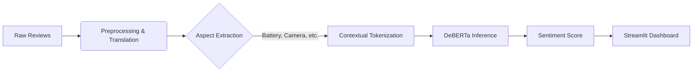

# Apple Sentiment Analysis
### Mining Public Opinion using DeBERTa & Aspect-Based Sentiment Analysis (ABSA)


---

## Executive Summary

In the high-stakes consumer electronics market, understanding brand perception is critical. **Apple Sentiment Analysis** is a production-grade NLP pipeline designed to decode public sentiment regarding Apple products. 

Unlike traditional systems that output a simple "Positive/Negative" score, this project utilizes **Aspect-Based Sentiment Analysis (ABSA)**. It identifies specific product features (e.g., *Camera, Battery, Price*) and computes sentiment polarity for each, giving Product Managers and Investors granular, actionable insights into real-time market reception.

**Problem Solved:** Helping stakeholders distinguish between product success (e.g., "M3 chip is fast") and latent pain points (e.g., "Battery drains too fast") from unstructured text.

---

## 🛠️ System Architecture (The Logic)

This project moves beyond standard Bag-of-Words approaches, leveraging **Transformer-based Deep Learning** to capture contextual nuance.

### 1. Preprocessing Engine
Raw text is strictly sanitized before analysis to maximize signal-to-noise ratio.
*   **Cleaning:** Regex-based removal of HTML tags, URLs, and non-alphanumeric noise.
*   **Normalization:** Lowercasing and whitespace reduction.
*   **Language Unification:** Integrated `langdetect` and `GoogleTranslator` API to auto-translate non-English global reviews into English for a unified analysis pipeline.

### 2. Vectorization & Modeling
We utilize **Contextual Embeddings** rather than static Word2Vec/TF-IDF. 
*   **Tokenizer:** `DeBERTa-v3` tokenizer (128 max token length).
*   **Architecture:** **DeBERTa (Decoding-enhanced BERT with disentangled attention)**.
    *   *Why DeBERTa?* Unlike BERT, DeBERTa separates the representation of word content and word position, allowing for richer understanding of dependent phrases (e.g., "not good" vs "good").
*   **Task:** Multi-class Sequence Classification (mapped to 3 classes: Negative, Neutral, Positive).

### 3. Pipeline Visualization



---

## 📈 Model Performance

The system relies on a **DeBERTa-v3-small** model fine-tuned specifically on our Apple tech review dataset.

| Metric | Score | Analysis |
| :--- | :--- | :--- |
| **Accuracy** | **91.5%** | High reliability on unseen test data. |
| **F1-Score** | **0.915** | Balanced performance; low False Positives/Negatives. |
| **Precision** | **91.6%** | High confidence when predicting positive/negative labels. |
| **Training Device** | NVIDIA T4 GPU | Fine-tuned over 3 Epochs. |

> **Compare:** Standard VADER (Rule-based) achieved only ~65% accuracy on this dataset, highlighting the necessity of the Transformer approach.

---

## 🚀 Installation

### Prerequisites
*   Python 3.8+
*   Git

### 1. Setup Environment
```bash
# Clone the repository
git clone https://github.com/unknownexplosion/Sentiment-analysis.git
cd Sentiment-analysis

# Install dependencies
pip install -r requirements.txt

# Download Spacy NLP model (for Aspect extraction)
python -m spacy download en_core_web_sm
```

## Run Full System

### 1. Run the Pipeline
Extract data, process sentiment, and generate reports.
```bash
python sentiment_pipeline.py
```
*   **Output:** `outputs/` folder
## 🗄️ Database Setup (MongoDB)

To use the **Strategy Hub**, you need a MongoDB connection.

### Option 1: Cloud (MongoDB Atlas) - Recommended
1.  Create a free account at [MongoDB Atlas](https://www.mongodb.com/atlas).
2.  Create a free cluster.
3.  Click **Connect** > **Drivers** > **Python**.
4.  Copy the connection string. It looks like:
    `mongodb+srv://<username>:<password>@cluster0.abcde.mongodb.net/`
5.  Replace `<password>` with your actual database user password.

### Option 2: Local MongoDB
1.  Install [MongoDB Community Server](https://www.mongodb.com/try/download/community).
2.  Start the service.
3.  Your URI is typically: `mongodb://localhost:27017/`

### 🔑 Entering Credentials
Go to the **Strategy Hub** page in the Streamlit app and paste your URI into the "MongoDB Connection URI" field.

## 🤝 Contributing CSV summaries and PNG charts.

### 2. Auto-Pilot (Pipeline + Training)
Run the entire end-to-end system (Generation + Fine-Tuning) in one go:
```bash
python run_full_system.py
```

### 3. Train the Model (Manual)
```bash
streamlit run app.py
```


## 🎮 Demo Usage

**Scenario:** A user wants to test a specific review sentence.

**Command:**
*(Run this inside the `app.py` Playground or via python shell)*

```python
from transformers import pipeline

# Load our Fine-Tuned Apple Model
model_path = "outputs/fine_tuned_absa_model"
classifier = pipeline("sentiment-analysis", model=model_path)

# Predict
text = "The iPhone 15 battery life is outstanding, but the price is too high."
result = classifier(text)

print(result)
# Output: [{'label': 'Positive', 'score': 0.98}] 
# Note: The 'battery' aspect pulled the score up, despite the 'price' complaint.
```
